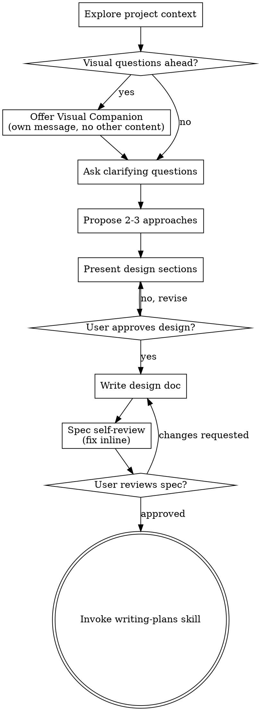

# 将想法头脑风暴成设计

通过自然的协作对话帮助将想法转化为完全成型的设计和规范。

首先理解当前项目上下文，然后一次问一个问题来完善想法。一旦你理解了在构建什么，呈现设计并获得用户批准。

<HARD-GATE>
在呈现设计并获得用户批准之前，不要调用任何实现技能、不要写任何代码、不要搭建任何项目、不要采取任何实现行动。这适用于每一个项目，无论感知上多么简单。
</HARD-GATE>

## 反模式："这太简单了不需要设计"

每个项目都要经过这个过程。一个待办事项列表、一个单函数工具、一个配置更改——所有这些。"简单"的项目是未审视的假设导致最多浪费工作的地方。设计可以很短（真正简单的项目几句话），但你必须呈现它并获得批准。

## 清单

你必须为以下每个项目创建一个任务并按顺序完成它们：

1. **探索项目上下文** — 检查文件、文档、最近的提交
2. **提供视觉伴侣**（如果主题将涉及视觉问题） — 这是它自己的消息，不能与澄清问题合并。见下面的视觉伴侣部分。
3. **询问澄清问题** — 一次一个，理解目的/约束/成功标准
4. **提出 2-3 种方法** — 包含权衡和你的推荐
5. **呈现设计** — 按复杂度缩放的章节，每节后获得用户批准
6. **编写设计文档** — 保存到 `docs/superpowers/specs/YYYY-MM-DD-<topic>-design.md` 并提交
7. **规范自审** — 快速的内联检查占位符、矛盾、模糊性、范围（见下文）
8. **用户审查书面规范** — 在继续之前请用户审查规范文件
9. **过渡到实现** — 调用 writing-plans 技能创建实现计划

## 流程图

**终态是调用 writing-plans。** 不要调用 frontend-design、mcp-builder 或任何其他实现技能。头脑风暴后你调用的唯一技能是 writing-plans。

## 过程

**理解想法：**

- 首先查看当前项目状态（文件、文档、最近的提交）
- 在询问详细问题之前，评估范围：如果请求描述了多个独立子系统（例如，"构建一个具有聊天、文件存储、计费和分析的平台"），立即标记这一点。不要花问题来完善需要先分解的项目的细节。
- 如果项目对于单个规范来说太大，帮助用户分解为子项目：什么是独立的部分，它们如何相关，应该按什么顺序构建？然后通过正常的设计流程对第一个子项目进行头脑风暴。每个子项目都有自己的规范 → 计划 → 实现循环。
- 对于范围适当的项目，一次问一个问题来完善想法
- 尽可能优先选择多选题，但开放式问题也可以
- 每条消息只问一个问题 - 如果一个主题需要更多探索，将其分解为多个问题
- 专注于理解：目的、约束、成功标准

**探索方法：**

- 提出 2-3 种不同的方法及其权衡
- 以对话方式呈现选项，附上你的推荐和推理
- 以你推荐的选项开头并解释为什么

**呈现设计：**

- 一旦你认为你理解了在构建什么，呈现设计
- 按复杂度缩放每个章节：如果直接就几句话，如果细致就 200-300 字
- 在每个章节后询问到目前为止是否看起来正确
- 涵盖：架构、组件、数据流、错误处理、测试
- 准备好在某些东西讲不通时回去澄清

**为隔离和清晰而设计：**

- 将系统分解为更小的单元，每个单元都有一个明确的目的，通过明确定义的接口进行通信，可以独立理解和测试
- 对于每个单元，你应该能够回答：它做什么，你如何使用它，它依赖什么？
- 有人能在不阅读其内部的情况下理解单元做什么吗？你能改变内部而不破坏消费者吗？如果不能，边界需要工作。
- 较小、良好界定的单元也更容易让你使用 - 你能更好地推理你能在上下文中一次容纳的代码，并且当文件聚焦时你的编辑更可靠。当文件变大时，这通常是一个信号表明它正在做太多事情。

**在现有代码库中工作：**

- 在提出更改之前探索当前结构。遵循现有模式。
- 在现有代码有问题影响工作的地方（例如，一个文件变得太大、边界不清晰、责任纠缠），将针对性的改进作为设计的一部分 - 一个好的开发人员改进他们正在处理的代码的方式。
- 不要提出不相关的重构。专注于服务当前目标的内容。

## 设计之后

**文档：**

- 将验证过的设计（规范）写入 `docs/superpowers/specs/YYYY-MM-DD-<topic>-design.md`
  - （用户对规范位置的偏好会覆盖此默认值）
- 如果可用，使用 elements-of-style:writing-clearly-and-concisely 技能
- 将设计文档提交到 git

**规范自审：**
编写规范文档后，用全新的眼光看待它：

1. **占位符扫描：** 任何 "TBD"、"TODO"、不完整的章节或模糊的需求？修复它们。
2. **内部一致性：** 任何章节相互矛盾吗？架构是否与功能描述匹配？
3. **范围检查：** 这是否足够聚焦于单个实现计划，还是需要分解？
4. **模糊性检查：** 任何需求是否可以被两种不同的方式解释？如果是这样，选择一种并明确化。

内联修复任何问题。无需重新审查——只需修复并继续。

**用户审查关卡：**
在规范审查循环通过后，请在继续之前让用户审查书面规范：

> "规范已编写并提交到 `<path>`。请在开始编写实现计划之前审查它并让我知道你是否想做任何更改。"

等待用户的响应。如果他们要求更改，进行更改并重新运行规范审查循环。只有在用户批准后才能继续。

**实现：**

- 调用 writing-plans 技能创建详细的实现计划
- 不要调用任何其他技能。writing-plans 是下一步。

## 关键原则

- **一次一个问题** - 不要用多个问题压倒
- **优先多选** - 在可能的情况下比开放式问题更容易回答
- **无情的 YAGNI** - 从所有设计中删除不必要的功能
- **探索替代方案** - 在确定之前总是提出 2-3 种方法
- **增量验证** - 呈现设计，在继续之前获得批准
- **保持灵活** - 在某些东西讲不通时回去澄清

## 视觉伴侣

基于浏览器的伴侣，用于在头脑风暴期间显示模型图、图表和视觉选项。作为工具提供——不是模式。接受伴侣意味着它可用于受益于视觉处理的问题；这并不意味着每个问题都通过浏览器。

**提供伴侣：** 当你预期即将到来的问题将涉及视觉内容（模型图、布局、图表）时，为同意提供一次：
> "我们正在处理的一些内容如果我能在 Web 浏览器中向你展示可能会更容易解释。我可以在过程中组合模型图、图表、比较和其他视觉效果。此功能仍然较新且可能 token 密集。想试试吗？（需要打开本地 URL）"

**此提供必须是它自己的消息。** 不要将其与澄清问题、上下文摘要或任何其他内容合并。消息应仅包含上述提供的内容。在继续之前等待用户的响应。如果他们拒绝，继续进行仅文本的头脑风暴。

**每问题决策：** 即使在用户接受后，也要为每个问题决定是使用浏览器还是终端。测试：**用户是否通过看到它比通过阅读它更好地理解这一点？**

- **使用浏览器**用于内容本身是视觉的——模型图、线框图、布局比较、架构图、并排的视觉设计
- **使用终端**用于内容是文本的——需求问题、概念选择、权衡列表、A/B/C/D 文本选项、范围决策

关于 UI 主题的问题不会自动成为视觉问题。"此上下文中的个性是什么意思？" 是一个概念性问题——使用终端。"哪种向导布局效果更好？" 是一个视觉问题——使用浏览器。

如果他们同意伴侣，请在继续之前阅读详细指南：
`skills/brainstorming/visual-companion.md`
