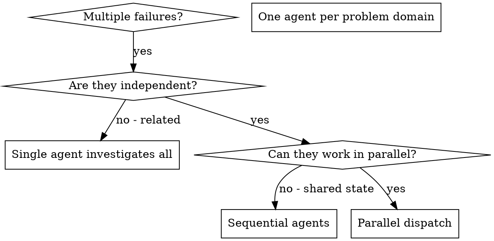

# Dispatching Parallel Agents（分派并行代理）

## 概述

你把任务委派给具有隔离上下文的专门代理。通过精确编写它们的指令和上下文，你确保它们能保持专注并成功完成任务。它们**绝不应该**继承你的会话上下文或历史 —— 你要构造它们所需的精确信息。这同时也为你的协调工作保留了上下文。

当你有多个不相关的失败（不同的测试文件、不同的子系统、不同的 bug）时，串行调查会浪费时间。每个调查都是独立的，可以并行进行。

**核心原则：** 每个独立的问题域分派一个代理。让它们并发工作。

## 何时使用



**适用于：**
- 3+ 个测试文件因不同根因失败
- 多个子系统被独立破坏
- 每个问题可以在不依赖其他上下文的情况下理解
- 调查之间没有共享状态

**不适用于：**
- 失败是相关的（修一个可能修其他）
- 需要理解完整的系统状态
- 代理会互相干扰

## 模式

### 1. 识别独立域

按"哪里坏了"对失败分组：
- 文件 A 的测试：工具审批流程
- 文件 B 的测试：批处理完成行为
- 文件 C 的测试：中止功能

每个域是独立的 —— 修复工具审批不会影响中止测试。

### 2. 创建聚焦的代理任务

每个代理获得：
- **具体范围：** 一个测试文件或子系统
- **明确目标：** 让这些测试通过
- **约束条件：** 不要改其他代码
- **预期输出：** 你发现并修复的内容摘要

### 3. 并行分派

```typescript
// 在 Claude Code / AI 环境中
Task("Fix agent-tool-abort.test.ts failures")
Task("Fix batch-completion-behavior.test.ts failures")
Task("Fix tool-approval-race-conditions.test.ts failures")
// 三个并发执行
```

### 4. 审查与集成

代理返回时：
- 读取每个摘要
- 验证修复不冲突
- 跑完整测试套件
- 集成所有改动

## 代理 Prompt 结构

好的代理 prompt 是：
1. **聚焦的** —— 一个明确的问题域
2. **自洽的** —— 理解问题所需的全部上下文
3. **明确指定输出的** —— 代理应该返回什么？

```markdown
Fix the 3 failing tests in src/agents/agent-tool-abort.test.ts:

1. "should abort tool with partial output capture" - expects 'interrupted at' in message
2. "should handle mixed completed and aborted tools" - fast tool aborted instead of completed
3. "should properly track pendingToolCount" - expects 3 results but gets 0

These are timing/race condition issues. Your task:

1. Read the test file and understand what each test verifies
2. Identify root cause - timing issues or actual bugs?
3. Fix by:
   - Replacing arbitrary timeouts with event-based waiting
   - Fixing bugs in abort implementation if found
   - Adjusting test expectations if testing changed behavior

Do NOT just increase timeouts - find the real issue.

Return: Summary of what you found and what you fixed.
```

## 常见错误

**❌ 太宽泛：** "Fix all the tests" —— 代理会迷失
**✅ 具体：** "Fix agent-tool-abort.test.ts" —— 聚焦范围

**❌ 无上下文：** "Fix the race condition" —— 代理不知道在哪
**✅ 上下文：** 粘贴错误信息和测试名

**❌ 无约束：** 代理可能重构一切
**✅ 约束：** "Do NOT change production code" 或 "Fix tests only"

**❌ 输出含糊：** "Fix it" —— 你不知道改了什么
**✅ 具体：** "Return summary of root cause and changes"

## 何时不使用

**相关失败：** 修一个可能修其他 —— 先一起调查
**需要完整上下文：** 理解需要看整个系统
**探索性调试：** 你还不知道哪里坏了
**共享状态：** 代理会互相干扰（编辑同一文件、使用同一资源）

## 真实案例（来自会话）

**场景：** 重大重构后 3 个文件 6 个测试失败

**失败：**
- agent-tool-abort.test.ts：3 个失败（时序问题）
- batch-completion-behavior.test.ts：2 个失败（工具未执行）
- tool-approval-race-conditions.test.ts：1 个失败（执行计数 = 0）

**决策：** 独立域 —— 中止逻辑与批处理完成分离，与竞态条件分离

**分派：**
```
Agent 1 → 修复 agent-tool-abort.test.ts
Agent 2 → 修复 batch-completion-behavior.test.ts
Agent 3 → 修复 tool-approval-race-conditions.test.ts
```

**结果：**
- Agent 1：用基于事件的等待替代超时
- Agent 2：修复事件结构 bug（threadId 位置错误）
- Agent 3：添加等待异步工具执行完成

**集成：** 所有修复独立，无冲突，完整套件通过

**节省时间：** 3 个问题并行解决 vs 串行

## 关键收益

1. **并行化** —— 多个调查同时进行
2. **聚焦** —— 每个代理范围窄，要追踪的上下文少
3. **独立** —— 代理互不干扰
4. **速度** —— 3 个问题在 1 个问题的时间里解决

## 验证

代理返回后：
1. **审查每个摘要** —— 理解改了什么
2. **检查冲突** —— 代理编辑了同一份代码吗？
3. **跑完整套件** —— 验证所有修复协同工作
4. **抽查** —— 代理可能犯系统性错误

## 实际影响

来自调试会话（2025-10-03）：
- 6 个失败跨 3 个文件
- 3 个代理并行分派
- 所有调查并发完成
- 所有修复成功集成
- 代理改动零冲突
