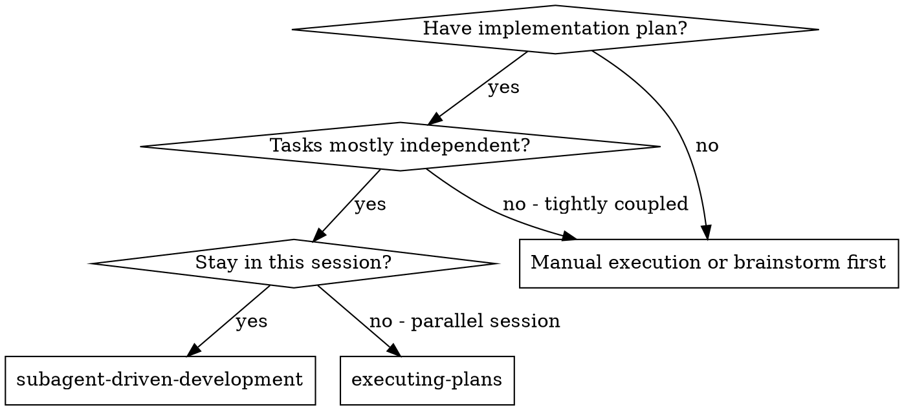
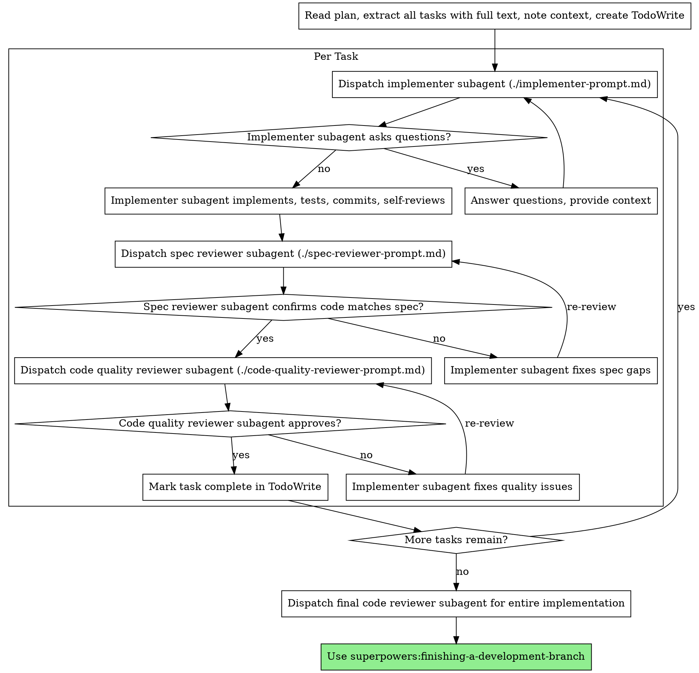

# 子代理驱动开发

通过为每个任务分派全新的子代理来执行计划，每个任务后进行两阶段审查：先是规范符合性审查，然后是代码质量审查。

**为何使用子代理：** 你将任务委托给具有隔离上下文的专门代理。通过精确构建它们的指令和上下文，你确保它们保持专注并成功完成任务。它们**绝不**应当继承你当前会话的上下文或历史——你只为它们构建正好需要的内容。这样同时也保留了你自己的上下文用于协调工作。

**核心原则：** 每个任务一个全新的子代理 + 两阶段审查（规范后质量）= 高质量、快速迭代

**持续执行：** 不要在任务之间停下来与你的 human partner 确认。执行计划中的所有任务而不停止。停止的唯一理由是：你无法解决的 BLOCKED 状态、真正阻碍进展的歧义，或所有任务完成。"我应该继续吗？" 式的提问和进度总结会浪费他们的时间——他们要求你执行计划，那就执行。

## 何时使用



**vs. 执行计划（并行会话）：**
- 同一会话（无上下文切换）
- 每个任务一个全新的子代理（无上下文污染）
- 每个任务后的两阶段审查：先是规范符合性，然后是代码质量
- 迭代更快（任务之间无需 human-in-loop）

## 流程



## 模型选择

使用能处理每个角色的最弱模型，以节省成本并提高速度。

**机械实现任务**（孤立函数、清晰规范、1-2 个文件）：使用快速、便宜的模型。当计划明确时，大多数实现任务都是机械性的。

**集成和判断任务**（多文件协调、模式匹配、调试）：使用标准模型。

**架构、设计和审查任务**：使用可用的最强模型。

**任务复杂度信号：**
- 触及 1-2 个文件且有完整规范 → 便宜模型
- 触及多个文件且有集成考虑 → 标准模型
- 需要设计判断或广泛的代码库理解 → 最强模型

## 处理实施者状态

实施者子代理报告四种状态之一。适当处理每种状态：

**DONE：** 进入规范符合性审查。

**DONE_WITH_CONCERNS：** 实施者完成了工作但标记了疑虑。在继续之前阅读疑虑。如果疑虑涉及正确性或范围，在审查前解决它们。如果只是观察（例如"这个文件变大了"），记下它们并继续审查。

**NEEDS_CONTEXT：** 实施者需要未提供的信息。提供缺失的上下文并重新分派。

**BLOCKED：** 实施者无法完成任务。评估阻塞原因：
1. 如果是上下文问题，提供更多上下文并使用相同模型重新分派
2. 如果任务需要更多推理，使用更强的模型重新分派
3. 如果任务太大，分解为更小的部分
4. 如果计划本身错误，升级给 human

**绝不**忽视升级或强迫相同模型在不更改的情况下重试。如果实施者说卡住了，说明有些事情需要改变。

## Prompt 模板

- `./implementer-prompt.md` —— 分派实施者子代理
- `./spec-reviewer-prompt.md` —— 分派规范符合性审查者子代理
- `./code-quality-reviewer-prompt.md` —— 分派代码质量审查者子代理

## 示例工作流

```
You: 我正在使用子代理驱动开发来执行这个计划。

[读取计划文件一次：docs/superpowers/plans/feature-plan.md]
[提取所有 5 个任务的完整文本和上下文]
[创建包含所有任务的 TodoWrite]

Task 1: Hook 安装脚本

[获取 Task 1 文本和上下文（已提取）]
[分派实施子代理，附上完整任务文本 + 上下文]

Implementer: "在我开始之前 —— hook 应该安装在用户级还是系统级？"

You: "用户级（~/.config/superpowers/hooks/）"

Implementer: "明白了。现在开始实施..."
[稍后] Implementer:
  - 实现了 install-hook 命令
  - 添加了测试，5/5 通过
  - 自我审查：发现漏掉了 --force 标志，已添加
  - 已提交

[分派规范符合性审查者]
Spec reviewer: ✅ 规范符合 —— 所有需求已满足，没有额外内容

[获取 git SHAs，分派代码质量审查者]
Code reviewer: Strengths: 良好的测试覆盖，代码清晰。Issues: 无。Approved。

[标记 Task 1 完成]

Task 2: 恢复模式

[获取 Task 2 文本和上下文（已提取）]
[分派实施子代理，附上完整任务文本 + 上下文]

Implementer: [没有问题，继续]
Implementer:
  - 添加了 verify/repair 模式
  - 8/8 测试通过
  - 自我审查：一切良好
  - 已提交

[分派规范符合性审查者]
Spec reviewer: ❌ Issues:
  - 缺少：进度报告（规范说"每 100 项报告一次"）
  - 额外：添加了 --json 标志（未请求）

[实施者修复问题]
Implementer: 移除了 --json 标志，添加了进度报告

[规范审查者重新审查]
Spec reviewer: ✅ 现在规范符合

[分派代码质量审查者]
Code reviewer: Strengths: 扎实。Issues (Important): 魔数 (100)

[实施者修复]
Implementer: 提取了 PROGRESS_INTERVAL 常量

[代码审查者重新审查]
Code reviewer: ✅ Approved

[标记 Task 2 完成]

...

[所有任务之后]
[分派最终代码审查者]
Final reviewer: 所有需求已满足，可以合入

Done!
```

## 优势

**vs. 手动执行：**
- 子代理自然地遵循 TDD
- 每个任务全新的上下文（无混淆）
- 并行安全（子代理不会相互干扰）
- 子代理可以提问（工作前与工作中都可以）

**vs. 执行计划：**
- 同一会话（无交接）
- 持续进展（无需等待）
- 审查检查点自动化

**效率提升：**
- 无文件读取开销（控制器提供完整文本）
- 控制器精确策划所需的上下文
- 子代理一次性获得完整信息
- 问题在工作开始前就浮现（而不是之后）

**质量门控：**
- 自我审查在交接前抓住问题
- 两阶段审查：规范符合性，然后代码质量
- 审查循环确保修复真的有效
- 规范符合性防止过度/不足构建
- 代码质量确保实现构建良好

**成本：**
- 更多子代理调用（每个任务实施者 + 2 个审查者）
- 控制器做更多准备工作（一次性提取所有任务）
- 审查循环增加迭代
- 但能更早抓住问题（比稍后调试便宜）

## 红旗

**绝对不要：**
- 没有显式用户同意就在 main/master 分支上开始实现
- 跳过审查（规范符合性 或 代码质量）
- 在未修复问题的情况下继续
- 并行分派多个实施子代理（冲突）
- 让子代理读取计划文件（改为提供完整文本）
- 跳过场景设置上下文（子代理需要理解任务的整体位置）
- 忽视子代理的问题（在让它们继续之前回答）
- 在规范符合性上接受"差不多就行"（规范审查者发现问题 = 未完成）
- 跳过审查循环（审查者发现问题 = 实施者修复 = 再次审查）
- 让实施者自我审查代替实际审查（两者都需要）
- **在规范符合性通过 ✅ 之前开始代码质量审查**（错误顺序）
- 在任一审查有未解决问题时进入下一个任务

**如果子代理提问：**
- 清晰完整地回答
- 必要时提供额外上下文
- 不要急于让它们开始实现

**如果审查者发现问题：**
- 实施者（同一子代理）修复它们
- 审查者再次审查
- 重复直到通过
- 不要跳过重新审查

**如果子代理任务失败：**
- 分派带具体指令的修复子代理
- 不要手动修复（上下文污染）

## 集成

**必需的工作流技能：**
- **superpowers:using-git-worktrees** —— 确保隔离的工作区（创建一个或验证现有）
- **superpowers:writing-plans** —— 创建本技能执行的计划
- **superpowers:requesting-code-review** —— 审查者子代理的代码审查模板
- **superpowers:finishing-a-development-branch** —— 所有任务完成后完成开发

**子代理应当使用：**
- **superpowers:test-driven-development** —— 子代理为每个任务遵循 TDD

**备选工作流：**
- **superpowers:executing-plans** —— 用于并行会话而不是同会话执行
