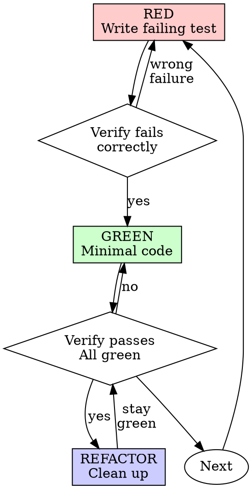

# test-driven-development/SKILL.md 分析报告

## 一、基本信息

- **文件路径**：`skills/test-driven-development/SKILL.md`
- **文件大小**：372 行
- **文档类型**：技能主文档（带 YAML frontmatter）
- **配套文件**：`testing-anti-patterns.md`（反模式参考）
- **文档定位**：TDD 完整规范

## 二、目的

该技能是 Superpowers 项目的**"开发纪律核心"**——它定义严格的 TDD（Test-Driven Development）流程，确保：

1. **每个生产代码都有测试**——没有"无测试的代码"
2. **测试必须先于代码**——而不是事后补充
3. **测试必须先失败**——证明它真的在测试某些东西

它把 TDD 从"个人偏好" 提升为"项目级硬约束"。

## 三、核心技术决策

### 3.1 "铁律"（Iron Law）—— 最强约束

```
NO PRODUCTION CODE WITHOUT A FAILING TEST FIRST
```

**这是整个技能最强约束**——它用全大写 + 命令式语气声明：

- 没有"失败的测试" → 不能写"生产代码"
- 这是 TDD 的**绝对铁律**

后续的"无例外"清单进一步加强：

> **No exceptions:**
> - Don't keep it as "reference"
> - Don't "adapt" it while writing tests
> - Don't look at it
> - Delete means delete

**4 条"无例外"**精准打击 LLM 的典型失败模式：

- "保留作参考" → LLM 倾向"舍不得删"
- "改造它" → LLM 倾向"边改边写"
- "看一眼" → LLM 倾向"参考已有思路"
- "删就是删" → 反 LLM 软化纪律

**这种"绝对命令 + 无例外清单"是 LLM 协作中反"自我合理化"的关键设计**。

### 3.2 核心原则的"反合理化"包装

> **Core principle:** If you didn't watch the test fail, you don't know if it tests the right thing.

**这一句是整个 TDD 哲学的浓缩**——它解释了**为什么**要先看到测试失败：

- 没看到测试失败 = 不知道测试是否真的有效
- 通过的测试可能测错了东西
- 通过的测试可能没测东西
- **"看到失败"是测试有效性的唯一证明**

> **Violating the letter of the rules is violating the spirit of the rules.**

**这一句是 LLM 协作的关键**——它显式说：

- 别找"漏洞"绕过纪律
- 找漏洞 = 违反精神
- 严格遵守 = 真正遵守

这是 LLM 协作中的"反钻空子" 设计。

### 3.3 Red-Green-Refactor 循环的形式化（Graphviz）



**Graphviz 形式化的关键设计**：

- **3 个验证菱形**（verify_red、verify_green、stay green）—— 显式声明"验证"是必经节点
- **3 个回环**（wrong failure → red、no → green、stay green）—— 显式声明"失败/破坏" 必须回退
- **3 种颜色**（红/绿/蓝）—— 视觉化区分状态
- **next → red** —— 显式声明"下一个测试"是循环

**这种"形式化流程图"是 LLM 协作中的关键设计**——它**让 TDD 循环成为可被推理的结构**，而不是"模糊的步骤"。

### 3.4 "Verify RED" 段的强约束

> **Verify RED - Watch It Fail**
> **MANDATORY. Never skip.**

**这一段是 TDD 的"必看失败"原则**——它强制：

- 写完测试 → **必须**运行 → **必须**看到失败
- 跳过这一步 = 跳过 TDD

**两个关键诊断**：

> **Test passes?** You're testing existing behavior. Fix test.
> **Test errors?** Fix error, re-run until it fails correctly.

这两种诊断精准打击 LLM 的"测试看似通过" 失败模式：

- **Test passes**（测试通过） → 你在测已有行为 → 修复测试
- **Test errors**（测试出错） → 修复错误 → 重新运行

LLM 倾向"看到 PASS 就走"——本段显式否定这种行为。

### 3.5 "Verify GREEN" 的全测试检查

> **Verify GREEN - Watch It Pass**
> Confirm:
> - Test passes
> - Other tests still pass
> - Output pristine (no errors, warnings)

**3 项确认** 比单一项"测试通过"更严格：

- 本测试通过
- **其他测试也通过**（无破坏）
- 输出干净（无 warning、error）

**特别是 "Other tests still pass"**——这强制 LLM **在写新代码时考虑全局影响**，而不是只看本测试。

### 3.6 "Good Tests" 的极简要求

| 质量 | 好 | 坏 |
|---------|------|-----|
| **最小** | 一件事。名称里有"and"？拆分。 | `test('validates email and domain and whitespace')` |
| **清晰** | 名称描述行为 | `test('test1')` |
| **表达意图** | 展示期望的 API | 模糊了代码应该做什么 |

**3 条极简要求**——每一条都有"好/坏"对比：

- **最小**：名称里有"and" → 拆分
- **清晰**：名称描述行为
- **表达意图**：展示 API

**"名称里有'and'就拆分"是 LLM 协作中的具体可操作规则**。

### 3.7 "Why Order Matters" 段 —— 4 大反合理化

文档用 4 段长文反驳 4 种典型的"测试后写"合理化：

| 借口 | 反驳 |
|---|---|
| "I'll write tests after to verify it works" | 测试后写立即通过 → 证明不了什么 |
| "I already manually tested all the edge cases" | 手动测试是临时 → 无记录、不能重跑 |
| "Deleting X hours of work is wasteful" | 沉没成本谬误 → 保留未验证代码是技术债 |
| "TDD is dogmatic, being pragmatic means adapting" | TDD 就是务实 → 比调试更快 |
| "Tests after achieve the same goals - it's spirit not ritual" | Tests-after 回答"做什么"，Tests-first 回答"应该做什么" |

**5 段反驳**精准打击 LLM 在 TDD 上的 5 大合理化：

- "以后再测" → 反驳：立即通过证明不了什么
- "手动测过了" → 反驳：无记录、不能重跑
- "删 X 小时太浪费" → 反驳：沉没成本谬误
- "TDD 教条" → 反驳：TDD 就是务实
- "精神不是仪式" → 反驳：精神上就不同

**这种"显式反驳合理化"是 LLM 协作中的关键设计**——LLM 倾向"找理由绕过纪律"，本段**显式列出理由并逐个反驳**。

### 3.8 "Common Rationalizations" 11 条借口表

| 借口 | 现实 |
|--------|---------|
| "Too simple to test" | Simple code breaks. Test takes 30 seconds. |
| "I'll test after" | Tests passing immediately prove nothing. |
| "Tests after achieve same goals" | Tests-after = "what does this do?" Tests-first = "what should this do?" |
| "Already manually tested" | Ad-hoc ≠ systematic. No record, can't re-run. |
| "Deleting X hours is wasteful" | Sunk cost fallacy. Keeping unverified code is technical debt. |
| "Keep as reference, write tests first" | You'll adapt it. That's testing after. Delete means delete. |
| "Need to explore first" | Fine. Throw away exploration, start with TDD. |
| "Test hard = design unclear" | Listen to test. Hard to test = hard to use. |
| "TDD will slow me down" | TDD faster than debugging. Pragmatic = test-first. |
| "Manual test faster" | Manual doesn't prove edge cases. You'll re-test every change. |
| "Existing code has no tests" | You're improving it. Add tests for existing code. |

**11 条借口** 对应 **11 条反驳**——形成**完整的"借口-现实"对照表**：

- 11 条借口覆盖 LLM 合理化的所有角度
- 每条反驳都直接攻击借口的核心
- **最后一条 "Existing code has no tests"** 把借口转化为"现在加测试" 的正当理由

**这种"对照表"是 LLM 协作中反合理化的完整武器库**。

### 3.9 "Red Flags - STOP and Start Over" 13 条

```
- Code before test
- Test after implementation
- Test passes immediately
- Can't explain why test failed
- Tests added "later"
- Rationalizing "just this once"
- "I already manually tested it"
- "Tests after achieve the same purpose"
- "It's about spirit not ritual"
- "Keep as reference" or "adapt existing code"
- "Already spent X hours, deleting is wasteful"
- "TDD is dogmatic, I'm being pragmatic"
- "This is different because..."
```

**13 条红旗**是 TDD 的"硬触发器"——任何一条出现 → **删除代码，从头开始**。

**最后一句是关键**：

> **All of these mean: Delete code. Start over with TDD.**

**没有"几乎可以"——任何红旗出现都意味着从头开始**。这种"零容忍" 是 TDD 纪律的最终保障。

### 3.10 "Verification Checklist" 8 项

```
- [ ] Every new function/method has a test
- [ ] Watched each test fail before implementing
- [ ] Each test failed for expected reason (feature missing, not typo)
- [ ] Wrote minimal code to pass each test
- [ ] All tests pass
- [ ] Output pristine (no errors, warnings)
- [ ] Tests use real code (mocks only if unavoidable)
- [ ] Edge cases and errors covered
```

**8 项清单**是 TDD 的"完成门"——任何一项未勾选 = 未完成 TDD。

**最后一句**：

> Can't check all boxes? You skipped TDD. Start over.

**强约束**：不能勾选所有项 = 跳过 TDD = 重来。

### 3.11 "When Stuck" 4 个问题-解决方案表

| 问题 | 解决方案 |
|---------|----------|
| Don't know how to test | Write wished-for API. Write assertion first. Ask your human partner. |
| Test too complicated | Design too complicated. Simplify interface. |
| Must mock everything | Code too coupled. Use dependency injection. |
| Test setup huge | Extract helpers. Still complex? Simplify design. |

**4 个"卡住"场景**+ **4 个解决方案**——每一个都把"测试难" 映射到"设计问题"：

- 不知道怎么测 → 简化 API
- 测试太复杂 → 设计太复杂
- 必须 mock 一切 → 代码耦合
- 测试 setup 很大 → 简化设计

**"测试困难 = 设计问题"** 是 TDD 的核心洞察之一——本表让 LLM **遇到测试难时**想到"是不是设计有问题"。

## 四、文件结构

文件结构清晰，14 段：

```
1. YAML frontmatter
2. Overview（核心原则 + 精神 vs 仪式）
3. When to Use（始终 vs 例外 + 反合理化）
4. The Iron Law（最强约束 + 无例外清单）
5. Red-Green-Refactor（Graphviz 形式化循环）
   - RED - Write Failing Test
   - Verify RED - Watch It Fail
   - GREEN - Minimal Code
   - Verify GREEN - Watch It Pass
   - REFACTOR - Clean Up
   - Repeat
6. Good Tests（3 质量维度）
7. Why Order Matters（4 段长反驳）
8. Common Rationalizations（11 条借口-现实）
9. Red Flags - STOP and Start Over（13 条）
10. Example: Bug Fix（完整 TDD 流程）
11. Verification Checklist（8 项）
12. When Stuck（4 个问题-解决方案）
13. Debugging Integration（Bug 修复集成）
14. Testing Anti-Patterns（指向反模式文件）
15. Final Rule（生产代码 → 失败测试）
```

## 五、优点

### 5.1 极致的纪律性

整个文档 372 行充满了"必须 / 绝不 / 强制" 等绝对命令式语言：

- 铁律
- 无例外
- MANDATORY
- NEVER
- Delete means delete
- All of these mean: Delete code. Start over.

这种**纪律性**让 TDD 真正成为"硬约束" 而非"建议"。

### 5.2 反合理化的完整武器库

文档有 **3 层反合理化设计**：

- **5 段长反驳**（Why Order Matters 段）
- **11 条借口-现实对照表**（Common Rationalizations 段）
- **13 条红旗清单**（Red Flags 段）

这种**多层防御**让 LLM 在 TDD 上的合理化**几乎无路可走**。

### 5.3 Graphviz 形式化循环

Red-Green-Refactor 循环用 Graphviz 形式化：

- 3 个状态（红/绿/蓝）
- 3 个验证（verify_red/verify_green/stay green）
- 3 个回环（失败/未通过/破坏）

**形式化让 TDD 循环成为可推理的结构**，LLM 不会"跳步"。

### 5.4 "Good Tests" + "Bad Tests" 对照

每一项最佳实践都有"好"和"坏" 的代码示例（TypeScript）：

- 好测试：清晰名称、测试真实行为、一件事
- 坏测试：模糊名称、测试 mock、多件事

**对照让 LLM 真正理解"什么叫好测试"**。

### 5.5 "When Stuck" 把"测试难"映射到"设计问题"

4 个"卡住"场景 + 4 个解决方案——**每一个都把"测试难"映射到"设计问题"**：

- 不知道怎么测 → 简化 API
- 测试太复杂 → 设计太复杂
- 必须 mock 一切 → 代码耦合
- 测试 setup 很大 → 简化设计

**"测试困难 = 设计问题" 是 TDD 的核心洞察之一**——本表让 LLM **遇到测试难时**想到"是不是设计有问题"。

### 5.6 "Verification Checklist" 8 项完成门

8 项清单是 TDD 的"完成门"——任何一项未勾选 = 未完成 TDD。

**强约束的最后一句**：

> Can't check all boxes? You skipped TDD. Start over.

**这种"完成门 + 重来"的设计是 TDD 纪律的最终保障**。

## 六、缺点 / 风险

### 6.1 "精神 vs 仪式"反驳可能不够强

> **Violating the letter of the rules is violating the spirit of the rules.**

**这一句是反 LLM 钻空子的关键**——但 LLM 可能仍然会找"新的合理化"：

- "我虽然没看到测试失败，但功能明显缺失" → 精神上遵守
- "测试失败的原因和我想的不一样，但目标达成" → 精神上遵守

可以补充**具体的反例**：

- "看到失败但没记录" → 违反精神
- "看到失败但立刻改了测试" → 违反精神

### 6.2 "Delete means delete" 的强约束可能过度

> **No exceptions:**
> - Don't keep it as "reference"
> - Don't "adapt" it while writing tests
> - Don't look at it
> - Delete means delete

**这 4 条强约束可能过度**——某些情况下：

- 写一个工具函数 → 工具函数本身不算"生产代码"
- 写一个错误信息常量 → 常量本身不算"生产代码"
- 写一个数据类 → 数据类不算"生产代码"

**铁律可能让 LLM 过度激进地删除**所有代码。

可以补充：

- "Tool functions, constants, and data classes are not 'production code' under the Iron Law"

### 6.3 "Good Tests" 的 3 维度可能不够

3 维度（最小/清晰/表达意图）可能不够：

- 可维护性（测试代码本身的可读性）
- 独立性（不依赖其他测试）
- 速度（运行速度）
- 确定性（无 flake）

可以补充更多维度。

### 6.4 缺乏"测试金字塔"的指导

文档没说**单元/集成/UI 测试的比例**：

- 70% 单元 + 20% 集成 + 10% UI？
- 100% 单元？
- 视项目而定？

虽然 `testing-anti-patterns.md` 提到"考虑集成测试"，但 SKILL.md **没明确**。

### 6.5 缺乏"测试覆盖目标"的指导

文档没说**测试覆盖率目标**：

- 80% line coverage？
- 100% branch coverage？
- 视项目而定？

LLM 可能机械追求 100% → 浪费时间在低价值测试上。

### 6.6 "11 条借口"可能仍不够

11 条借口覆盖了大部分典型情况，但 LLM 可能创造**新的合理化**：

- "我已经单元测了，不需要 TDD"（绕开 TDD 但保留测试）
- "这是 trivial 函数"（夸大简单性）
- "我们赶时间"（压力下放弃纪律）

可以补充**"新合理化"应对策略**：遇到新借口时 → 立即停下来 → 重新读文档。

### 6.7 "When Stuck" 4 场景可能不够

4 个"卡住"场景可能不够：

- 测试运行慢（CI 太慢）
- 测试环境依赖（数据库/网络）
- 时间敏感的测试（time-of-day）
- 并发测试

可以补充更多"卡住"场景。

### 6.8 缺乏"集成 TDD 与现有代码库"的指导

"Existing code has no tests" 这条只说"为现有代码添加测试"——但**没说怎么做**：

- 是用 TDD 重写现有代码？
- 还是只为新功能写测试？
- 还是逐步补全旧代码的测试？

可以补充**集成策略**。

### 6.9 缺乏"性能测试"的指导

TDD 文档没提到**性能测试**：

- 性能如何用 TDD 测？
- 性能基准作为 failing test？
- 性能回归如何捕获？

可以补充。

## 七、关键洞察

### 7.1 这是 Superpowers 项目的"开发纪律核心"

整个项目有多个"开发"相关技能：

- `writing-plans` —— 写计划
- `subagent-driven-development` —— 实施计划
- **`test-driven-development`（本文件）** —— TDD 纪律
- `verification-before-completion` —— 完成前验证

**本技能是"开发纪律核心"**——它确保**写出的代码都有真实测试**。

### 7.2 "铁律 + 无例外" 是纪律的核心

> **The Iron Law:**
> ```
> NO PRODUCTION CODE WITHOUT A FAILING TEST FIRST
> ```
> **No exceptions:**
> - Don't keep it as "reference"
> - Don't "adapt" it while writing tests
> - Don't look at it
> - Delete means delete

**铁律 + 无例外清单**是 LLM 协作中的**纪律核心设计**：

- 铁律 = 命令
- 无例外清单 = 显式禁止合理化
- **两者结合**让 LLM **无法"找理由"绕过纪律**

### 7.3 "看到失败"是测试有效性的唯一证明

> **Core principle:** If you didn't watch the test fail, you don't know if it tests the right thing.

**这一句是 TDD 哲学的浓缩**——它解释了**为什么**要先看到测试失败：

- 没看到测试失败 = 不知道测试是否真的有效
- 通过的测试可能测错了东西
- 通过的测试可能没测东西

**"看到失败"是测试有效性的唯一证明**——这是 TDD 的方法论基石。

### 7.4 3 层反合理化防御

文档有 **3 层反合理化设计**：

- **5 段长反驳**（Why Order Matters 段）
- **11 条借口-现实对照表**（Common Rationalizations 段）
- **13 条红旗清单**（Red Flags 段）

**这种"多层防御"让 LLM 在 TDD 上的合理化几乎无路可走**。

### 7.5 "测试困难 = 设计问题" 是 TDD 的核心洞察

> | Test too complicated | Design too complicated. Simplify interface. |
> | Must mock everything | Code too coupled. Use dependency injection. |

**"测试困难 = 设计问题" 是 TDD 的核心洞察之一**——本表让 LLM **遇到测试难时**想到"是不是设计有问题"。

这种"测试驱动设计改进" 的洞察是 TDD 哲学的高阶内容。

### 7.6 Graphviz 形式化让循环可推理

Red-Green-Refactor 循环用 Graphviz 形式化：

- 3 个状态（红/绿/蓝）
- 3 个验证（verify_red/verify_green/stay green）
- 3 个回环（失败/未通过/破坏）

**形式化让 TDD 循环成为可推理的结构**——LLM 不会"跳步"。

## 八、关联文档

### 8.1 同目录

- `testing-anti-patterns.md`（[test-driven-development/testing-anti-patterns.md](file:///e:/WorkStation/MyProject/superpowers/skills/test-driven-development/testing-anti-patterns.md)）—— 反模式参考

### 8.2 集成技能

- `subagent-driven-development/implementer-prompt.md` —— 实施者子代理遵循 TDD
- `verification-before-completion/SKILL.md` —— 完成前验证
- `using-superpowers/SKILL.md` —— 母技能

### 8.3 测试

- `tests/skill-triggering/prompts/test-driven-development.txt` —— 触发测试
- `tests/explicit-skill-requests/prompts/use-systematic-debugging.txt` —— 调试与 TDD 集成

## 九、状态评价

**成熟度**：✅ **生产可用 + 核心纪律**

- 文档结构清晰、纪律强
- 反合理化设计多层防御
- 已经在项目中被实际使用

**完备度**：⭐⭐⭐⭐ (4/5)

- 核心机制完整
- 缺少"测试金字塔" 指导
- 缺少"测试覆盖目标"
- 缺少"性能测试" 集成

**风险等级**：🟡 中

- 主要风险是 LLM 钻空子（"精神 vs 仪式"）
- 3 层反合理化防御大部分缓解
- 但仍需要主代理具备"识别新合理化" 的能力

## 十、给读者的启示

### 10.1 启示 1：纪律 = 铁律 + 无例外清单

LLM 协作中的纪律需要：

- **铁律**：明确的命令
- **无例外清单**：显式禁止合理化

**两者结合**让 LLM **无法"找理由"绕过纪律**。

### 10.2 启示 2：反合理化要"多层防御"

LLM 倾向"找理由"绕过纪律。**反合理化需要多层防御**：

- **长反驳段**：解释为什么纪律是必要的
- **借口-现实对照表**：列出常见借口 + 反驳
- **红旗清单**：硬触发器

**3 层防御让 LLM 的合理化几乎无路可走**。

### 10.3 启示 3："看到失败"是验证有效性的唯一证明

> If you didn't watch the test fail, you don't know if it tests the right thing.

**"看到失败"是测试有效性的唯一证明**——这是 TDD 哲学的方法论基石。

可以推广到所有 LLM 协作场景：**验证必须包含"失败"的环节**，否则无效。

### 10.4 启示 4：流程应当用 Graphviz 形式化

复杂的 LLM 协作流程应当用 **Graphviz** 形式化：

- 状态可视化
- 验证节点显式化
- 回环显式化

**形式化让流程成为可推理的结构**——LLM 不会"跳步"。

### 10.5 启示 5："测试困难 = 设计问题" 是设计反馈循环

> | Test too complicated | Design too complicated. Simplify interface. |

**"测试困难 = 设计问题"是 TDD 的核心洞察**——可以推广到：

- "代码难读 = 设计问题"
- "API 难用 = 设计问题"
- "修改影响大 = 设计问题"

**测试/使用作为设计反馈循环**是工程哲学的高阶内容。

### 10.6 启示 6：完成门 + 重来是纪律的最终保障

> Can't check all boxes? You skipped TDD. Start over.

**完成门 + 重来** 是纪律的最终保障：

- 显式列出门的清单
- 不能通过 → 必须重来
- 没有"几乎可以"

## 十一、后续工作

### 11.1 可能的改进

1. **添加"测试金字塔"指导**
   - 单元/集成/UI 比例
   - 项目特定调整

2. **添加"测试覆盖目标"指导**
   - 推荐覆盖率范围
   - 不追求 100% 的说明

3. **添加"性能测试"集成**
   - 性能基准作为 failing test
   - 性能回归捕获

4. **添加"集成 TDD 与现有代码库"策略**
   - 旧代码补测的优先级
   - 渐进式 vs 重写

5. **添加"测试环境依赖"处理**
   - 数据库/网络的 mock 策略
   - TestContainers 等工具

6. **添加"并发测试"和"时间敏感测试"指导**

### 11.2 监控点

- TDD 跳过率（异常高 → LLM 钻空子）
- 测试覆盖率分布
- "看到失败"的实际触发频率
- 红旗触发后的"重来"频率

### 11.3 长期演进

- 与 AI 测试工具集成（自动生成测试）
- 引入"测试质量评估"（基于历史测试有效性）
- 引入"测试驱动的设计反馈"循环
