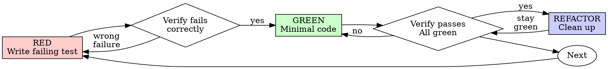

# 测试驱动开发（TDD）

## 概述

先写测试。看到它失败。写最少的代码让它通过。

**核心原则：** 如果你没有看到测试失败，你就不知道它是否测试了正确的东西。

**违反规则的字面就是违反规则的精神。**

## 何时使用

**始终：**
- 新功能
- Bug 修复
- 重构
- 行为变更

**例外（咨询你的 human partner）：**
- 一次性原型
- 生成的代码
- 配置文件

想着"就跳过这一次 TDD"？停下来。那是合理化。

## 铁律

```
没有失败的测试之前，不写生产代码
```

测试之前就写了代码？删掉。从头开始。

**没有例外：**
- 不要保留它作为"参考"
- 不要在写测试时"适应"它
- 不要看它
- 删就是删

从测试出发重新实现。就这么办。

## 红-绿-重构



### RED - 写失败的测试

写一个最小的测试来表明应该发生什么。

<Good>
```typescript
test('retries failed operations 3 times', async () => {
  let attempts = 0;
  const operation = () => {
    attempts++;
    if (attempts < 3) throw new Error('fail');
    return 'success';
  };

  const result = await retryOperation(operation);

  expect(result).toBe('success');
  expect(attempts).toBe(3);
});
```
清晰的名称，测试真实行为，专注一件事
</Good>

<Bad>
```typescript
test('retry works', async () => {
  const mock = jest.fn()
    .mockRejectedValueOnce(new Error())
    .mockRejectedValueOnce(new Error())
    .mockResolvedValueOnce('success');
  await retryOperation(mock);
  expect(mock).toHaveBeenCalledTimes(3);
});
```
名称模糊，测试的是 mock 而非代码
</Bad>

**要求：**
- 一个行为
- 清晰的名称
- 真实代码（除非不可避免，否则不用 mocks）

### 验证 RED - 看到它失败

**强制。永不跳过。**

```bash
npm test path/to/test.test.ts
```

确认：
- 测试失败（不是错误）
- 失败信息符合预期
- 失败是因为功能缺失（不是拼写错误）

**测试通过了？** 你在测试已有行为。修复测试。

**测试出错了？** 修复错误，重新运行直到它正确失败。

### GREEN - 最少的代码

写最简单的代码让测试通过。

<Good>
```typescript
async function retryOperation<T>(fn: () => Promise<T>): Promise<T> {
  for (let i = 0; i < 3; i++) {
    try {
      return await fn();
    } catch (e) {
      if (i === 2) throw e;
    }
  }
  throw new Error('unreachable');
}
```
刚好够通过
</Good>

<Bad>
```typescript
async function retryOperation<T>(
  fn: () => Promise<T>,
  options?: {
    maxRetries?: number;
    backoff?: 'linear' | 'exponential';
    onRetry?: (attempt: number) => void;
  }
): Promise<T> {
  // YAGNI
}
```
过度设计
</Bad>

不要添加功能、重构其他代码或"改进"超出测试的内容。

### 验证 GREEN - 看到它通过

**强制。**

```bash
npm test path/to/test.test.ts
```

确认：
- 测试通过
- 其他测试仍然通过
- 输出干净（无错误、警告）

**测试失败？** 修复代码，不要动测试。

**其他测试失败？** 立即修复。

### REFACTOR - 清理

只有在 green 之后：
- 移除重复
- 改进名称
- 提取辅助函数

保持测试绿色。不要添加行为。

### 重复

下一个功能的下一个失败测试。

## 好测试

| 质量 | 好 | 坏 |
|---------|------|-----|
| **最小** | 一件事。名称里有"and"？拆分。 | `test('validates email and domain and whitespace')` |
| **清晰** | 名称描述行为 | `test('test1')` |
| **表达意图** | 展示期望的 API | 模糊了代码应该做什么 |

## 为什么顺序很重要

**"我写完代码后再写测试来验证它工作"**

代码之后写的测试立即通过。立即通过什么都证明不了：
- 可能测试的是错误的东西
- 可能测试的是实现而非行为
- 可能漏掉你忘记的边界情况
- 你从未看到它抓住 bug

测试优先迫使你看到测试失败，证明它真的在测试某些东西。

**"我已经手动测试了所有边界情况"**

手动测试是临时的。你觉得你测试了所有东西但是：
- 没有测试的记录
- 代码变更时不能重新运行
- 压力下容易忘记某些情况
- "我试过能用" ≠ 全面

自动化测试是系统化的。它们每次运行都一样。

**"删除 X 小时的工作很浪费"**

沉没成本谬误。时间已经过去了。你现在的选择：
- 删除并用 TDD 重写（X 小时，高度自信）
- 保留并稍后加测试（30 分钟，低自信，可能有 bug）

"浪费"是保留你不能信任的代码。能工作但没有真实测试的代码是技术债。

**"TDD 是教条的，务实意味着适应"**

TDD 就是务实的：
- 在提交前找到 bug（比之后调试更快）
- 防止回归（测试立即捕捉破坏）
- 文档化行为（测试展示如何使用代码）
- 支持重构（自由变更，测试会捕捉破坏）

"务实" 的捷径 = 在生产环境调试 = 更慢。

**"代码后写测试达到同样目标 —— 这是精神不是仪式"**

不。代码后写测试回答"这是做什么的？" 测试优先回答"这应该做什么？"

代码后写测试被你的实现所偏向。你测试你构建的，而不是需要的。你验证记得的边界情况，而不是发现的。

测试优先在实现前强制发现边界情况。代码后写测试验证你记得了一切（你没有）。

30 分钟的代码后测试 ≠ TDD。你得到了覆盖率，失去了测试有效的证明。

## 常见合理化

| 借口 | 现实 |
|--------|---------|
| "太简单了不需要测试" | 简单代码也会坏。测试只需 30 秒。 |
| "我稍后测试" | 立即通过的测试什么都证明不了。 |
| "代码后写测试达到同样目标" | 代码后 = "这是做什么的？" 测试优先 = "这应该做什么？" |
| "已经手动测试了" | 临时 ≠ 系统化。没有记录，不能重跑。 |
| "删除 X 小时很浪费" | 沉没成本谬误。保留未验证的代码是技术债。 |
| "保留作参考，先写测试" | 你会适应它。那是事后测试。删就是删。 |
| "需要先探索" | 可以。扔掉探索，从 TDD 开始。 |
| "测试难 = 设计不清" | 听测试的。难测 = 难用。 |
| "TDD 会拖慢我" | TDD 比调试更快。务实 = 测试优先。 |
| "手动测试更快" | 手动无法证明边界情况。每次变更都要重新测试。 |
| "现有代码没有测试" | 你在改进它。为现有代码添加测试。 |

## 红旗 - 停下来从头开始

- 代码在测试之前
- 实现后写测试
- 测试立即通过
- 无法解释测试为何失败
- 测试"稍后"添加
- 合理化"就这一次"
- "我已经手动测试过了"
- "代码后写测试达到同样目的"
- "这是精神不是仪式"
- "保留作参考" 或 "改造现有代码"
- "已经花了 X 小时，删除很浪费"
- "TDD 是教条的，我才是务实的"
- "这不同因为..."

**所有这些都意味着：删除代码。从头开始 TDD。**

## 示例：Bug 修复

**Bug：** 接受空 email

**RED**
```typescript
test('rejects empty email', async () => {
  const result = await submitForm({ email: '' });
  expect(result.error).toBe('Email required');
});
```

**验证 RED**
```bash
$ npm test
FAIL: expected 'Email required', got undefined
```

**GREEN**
```typescript
function submitForm(data: FormData) {
  if (!data.email?.trim()) {
    return { error: 'Email required' };
  }
  // ...
}
```

**验证 GREEN**
```bash
$ npm test
PASS
```

**REFACTOR**
如果需要，为多个字段提取验证。

## 验证清单

在标记工作完成之前：

- [ ] 每个新函数/方法都有测试
- [ ] 实现前观看了每个测试失败
- [ ] 每个测试都因预期原因失败（功能缺失，不是拼写错误）
- [ ] 写了最少的代码让每个测试通过
- [ ] 所有测试通过
- [ ] 输出干净（无错误、警告）
- [ ] 测试使用真实代码（只有不可避免时才用 mock）
- [ ] 边界情况和错误被覆盖

不能勾选所有项？你跳过了 TDD。从头开始。

## 卡住时

| 问题 | 解决方案 |
|---------|----------|
| 不知道怎么测试 | 写期望的 API。先写断言。咨询你的 human partner。 |
| 测试太复杂 | 设计太复杂。简化接口。 |
| 必须 mock 一切 | 代码耦合太重。使用依赖注入。 |
| 测试 setup 很大 | 提取辅助函数。仍然复杂？简化设计。 |

## 调试集成

发现 bug？写失败测试复现它。遵循 TDD 循环。测试证明修复并防止回归。

永远不要在没测试的情况下修 bug。

## 测试反模式

添加 mock 或测试工具时，参考 @testing-anti-patterns.md 避免常见陷阱：
- 测试 mock 行为而非真实行为
- 给生产类添加仅测试方法
- 不理解依赖就 mock

## 最终规则

```
生产代码 → 测试存在且首先失败
否则 → 不是 TDD
```

未经你的 human partner 许可，没有例外。
