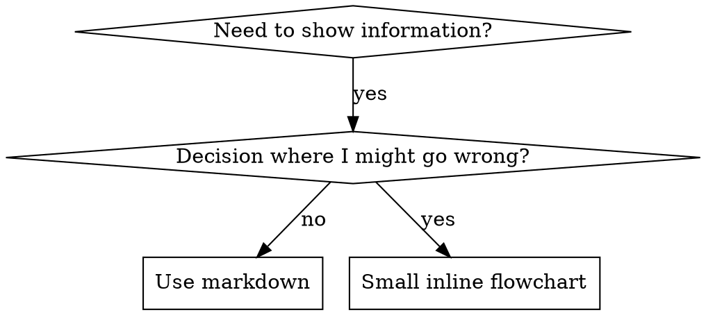

# 编写技能

## 概述

**编写技能就是将测试驱动开发（TDD）应用于过程文档。**

**个人技能存放在特定于 agent 的目录中（Claude Code 用 `~/.claude/skills`，Codex 用 `~/.agents/skills/`）**

你编写测试用例（针对子代理的压力场景），观察它们失败（基线行为），编写技能（文档），观察测试通过（agent 遵从），并重构（堵住漏洞）。

**核心原则：** 如果你没有观察过 agent 在没有技能时失败，你就不可能知道这个技能是否在教正确的东西。

**必要背景：** 在使用本技能之前，你必须先理解 superpowers:test-driven-development。该技能定义了基本的 RED-GREEN-REFACTOR 循环。本技能将 TDD 适配到文档领域。

**官方指南：** 关于 Anthropic 官方的技能编写最佳实践，请参阅 anthropic-best-practices.md。该文档提供了补充本技能中 TDD 聚焦方法的额外模式和指南。

## 什么是技能？

**技能**是针对成熟技术、模式或工具的参考指南。技能帮助未来的 Claude 实例查找并应用有效的方法。

**技能是：** 可复用的技术、模式、工具、参考指南

**技能不是：** 关于你如何一次解决某个问题的叙事

## 技能的 TDD 映射

| TDD 概念 | 技能创建 |
|---------|----------|
| **测试用例** | 针对子代理的压力场景 |
| **生产代码** | 技能文档（SKILL.md） |
| **测试失败（RED）** | agent 在没有技能时违反规则（基线） |
| **测试通过（GREEN）** | agent 在有技能时遵从 |
| **重构** | 在保持遵从的同时堵住漏洞 |
| **先写测试** | 在编写技能之前运行基线场景 |
| **观察测试失败** | 记录 agent 使用的精确合理化措辞 |
| **最小代码** | 编写针对那些具体违规的技能 |
| **观察测试通过** | 验证 agent 现在遵从了 |
| **重构循环** | 发现新的合理化 → 堵住 → 重新验证 |

整个技能创建过程遵循 RED-GREEN-REFACTOR。

## 何时创建技能

**在以下情况下创建：**
- 该技术对你来说不是直觉上显而易见的
- 你会跨项目再次参考这个
- 该模式广泛适用（非项目特定）
- 其他人也会受益

**不要为以下创建：**
- 一次性解决方案
- 已有良好文档的标准实践
- 项目特定约定（放在 CLAUDE.md 中）
- 机械性约束（如果可以用正则/验证强制执行，就自动化——把文档留给需要判断的决策）

## 技能类型

### 技术（Technique）
带有步骤的具体方法（condition-based-waiting、root-cause-tracing）

### 模式（Pattern）
思考问题的方式（flatten-with-flags、test-invariants）

### 参考（Reference）
API 文档、语法指南、工具文档（office 文档）

## 目录结构

```
skills/
  skill-name/
    SKILL.md              # 主参考（必需）
    supporting-file.*     # 仅在需要时
```

**扁平命名空间** - 所有技能位于一个可搜索的命名空间中

**以下情况拆分为单独文件：**
1. **大量参考**（100+ 行） - API 文档、全面的语法
2. **可复用工具** - 脚本、实用程序、模板

**保持内联：**
- 原则和概念
- 代码模式（< 50 行）
- 其他一切

## SKILL.md 结构

**前言（YAML）：**
- 两个必需字段：`name` 和 `description`（所有支持的字段请参见 [agentskills.io/specification](https://agentskills.io/specification)）
- 总共最多 1024 个字符
- `name`：仅使用字母、数字和连字符（不要括号、特殊字符）
- `description`：第三人称，仅描述何时使用（而不是做什么）
  - 以 "Use when..." 开头以聚焦于触发条件
  - 包含具体症状、情境和上下文
  - **绝不概括技能的过程或工作流**（原因见 CSO 部分）
  - 如果可能的话保持在 500 字符以内

```markdown
---
name: Skill-Name-With-Hyphens
description: Use when [specific triggering conditions and symptoms]
---

# 技能名称

## 概述
这是什么？用 1-2 句话说明核心原则。

## 何时使用
[小型内联流程图，如果决策不明显]

带有症状和用例的项目符号列表
何时不使用

## 核心模式（针对技术/模式）
前后代码对比

## 快速参考
用于扫描常见操作的表格或项目符号

## 实现
简单模式的内联代码
对大量参考或可复用工具的链接

## 常见错误
出错的地方 + 修复方法

## 实际影响（可选）
具体结果
```

## Claude 搜索优化（CSO）

**对发现性至关重要：** 未来的 Claude 需要找到你的技能

### 1. 丰富的描述字段

**目的：** Claude 读取描述以决定为给定任务加载哪些技能。让它回答："我现在应该读这个技能吗？"

**格式：** 以 "Use when..." 开头以聚焦于触发条件

**关键：描述 = 何时使用，而不是技能做什么**

描述应仅描述触发条件。不要在描述中概括技能的过程或工作流。

**为什么重要：** 测试显示，当描述概括了技能的工作流时，Claude 可能会遵循描述而不是阅读完整的技能内容。一条说"任务之间进行代码审查"的描述导致 Claude 只做了一次审查，尽管技能的流程图清楚地显示有两次审查（规范遵从然后代码质量）。

当描述被改为仅"Use when executing implementation plans with independent tasks"（不总结工作流）时，Claude 正确地读取了流程图并遵循了两阶段审查过程。

**陷阱：** 概括工作流的描述会创建 Claude 将采用的捷径。技能主体变成了 Claude 跳过的文档。

```yaml
# ❌ 差：概括了工作流 - Claude 可能遵循这个而不是阅读技能
description: Use when executing plans - dispatches subagent per task with code review between tasks

# ❌ 差：过多的过程细节
description: Use for TDD - write test first, watch it fail, write minimal code, refactor

# ✅ 好：仅是触发条件，没有工作流概括
description: Use when executing implementation plans with independent tasks in the current session

# ✅ 好：仅触发条件
description: Use when implementing any feature or bugfix, before writing implementation code
```

**内容：**
- 使用具体的触发器、症状和情境，指示此技能适用
- 描述*问题*（竞态条件、不一致的行为）而不是*语言特定的症状*（setTimeout、sleep）
- 除非技能本身是技术特定的，否则保持触发器与具体技术无关
- 如果技能是技术特定的，在触发器中明确说明
- 用第三人称写（注入到系统提示中）
- **绝不概括技能的过程或工作流**

```yaml
# ❌ 差：太抽象、模糊、不包含何时使用
description: For async testing

# ❌ 差：第一人称
description: I can help you with async tests when they're flaky

# ❌ 差：提到了技术但技能不是技术特定的
description: Use when tests use setTimeout/sleep and are flaky

# ✅ 好：以 "Use when" 开头，描述问题，没有工作流
description: Use when tests have race conditions, timing dependencies, or pass/fail inconsistently

# ✅ 好：技术特定的技能带有明确的触发器
description: Use when using React Router and handling authentication redirects
```

### 2. 关键词覆盖

使用 Claude 会搜索的词：
- 错误消息："Hook timed out"、"ENOTEMPTY"、"race condition"
- 症状："flaky"、"hanging"、"zombie"、"pollution"
- 同义词："timeout/hang/freeze"、"cleanup/teardown/afterEach"
- 工具：实际命令、库名、文件类型

### 3. 描述性命名

**使用主动语态、动词优先：**
- ✅ `creating-skills` 而非 `skill-creation`
- ✅ `condition-based-waiting` 而非 `async-test-helpers`

### 4. Token 效率（关键）

**问题：** 入门和频繁引用的技能加载到每次对话中。每个 token 都很重要。

**目标字数：**
- 入门工作流：每个 < 150 字
- 频繁加载的技能：总共 < 200 字
- 其他技能：< 500 字（仍然保持简洁）

**技巧：**

**将细节移到工具帮助中：**
```bash
# ❌ 差：在 SKILL.md 中记录所有标志
search-conversations supports --text, --both, --after DATE, --before DATE, --limit N

# ✅ 好：参考 --help
search-conversations supports multiple modes and filters. Run --help for details.
```

**使用交叉引用：**
```markdown
# ❌ 差：重复工作流细节
When searching, dispatch subagent with template...
[20 行重复的指令]

# ✅ 好：引用其他技能
Always use subagents (50-100x context savings). REQUIRED: Use [other-skill-name] for workflow.
```

**压缩示例：**
```markdown
# ❌ 差：冗长的示例（42 字）
your human partner: "How did we handle authentication errors in React Router before?"
You: I'll search past conversations for React Router authentication patterns.
[Dispatch subagent with search query: "React Router authentication error handling 401"]

# ✅ 好：最小示例（20 字）
Partner: "How did we handle auth errors in React Router?"
You: Searching...
[Dispatch subagent → synthesis]
```

**消除冗余：**
- 不要重复交叉引用的技能中已有的内容
- 不要解释从命令中明显看出的内容
- 不要包含同一模式的多个示例

**验证：**
```bash
wc -w skills/path/SKILL.md
# 入门工作流：目标 < 150
# 其他频繁加载：目标总共 < 200
```

**以你做什么或核心洞察命名：**
- ✅ `condition-based-waiting` > `async-test-helpers`
- ✅ `using-skills` 而非 `skill-usage`
- ✅ `flatten-with-flags` > `data-structure-refactoring`
- ✅ `root-cause-tracing` > `debugging-techniques`

**动名词（-ing）很适合过程：**
- `creating-skills`、`testing-skills`、`debugging-with-logs`
- 主动，描述你正在采取的行动

### 4. 交叉引用其他技能

**当编写引用其他技能的文档时：**

仅使用技能名称，附带明确的要求标记：
- ✅ 好：`**REQUIRED SUB-SKILL:** Use superpowers:test-driven-development`
- ✅ 好：`**REQUIRED BACKGROUND:** You MUST understand superpowers:systematic-debugging`
- ❌ 差：`See skills/testing/test-driven-development`（不清楚是否必需）
- ❌ 差：`@skills/testing/test-driven-development/SKILL.md`（强制加载，消耗上下文）

**为什么不用 @ 链接：** `@` 语法会立即强制加载文件，在你真正需要它们之前就消耗 200k+ 上下文。

## 流程图使用



**流程图仅用于：**
- 不明显的决策点
- 可能会过早停止的过程循环
- "何时用 A vs B" 的决策

**不要将流程图用于：**
- 参考材料 → 表格、列表
- 代码示例 → Markdown 块
- 线性指令 → 编号列表
- 没有语义含义的标签（step1、helper2）

参见 @graphviz-conventions.dot 获取 graphviz 风格规则。

**为你的 human partner 可视化：** 使用本目录中的 `render-graphs.js` 将技能的流程图渲染为 SVG：
```bash
./render-graphs.js ../some-skill           # 每个图分开
./render-graphs.js ../some-skill --combine # 所有图合并为一个 SVG
```

## 代码示例

**一个优秀的示例胜过许多平庸的**

选择最相关的语言：
- 测试技术 → TypeScript/JavaScript
- 系统调试 → Shell/Python
- 数据处理 → Python

**好的示例：**
- 完整且可运行
- 良好注释以解释为什么
- 来自真实场景
- 清楚地展示模式
- 准备好适配（非通用模板）

**不要：**
- 用 5+ 语言实现
- 创建填空模板
- 编写造作的示例

你擅长移植 - 一个好示例就够了。

## 文件组织

### 自包含的技能
```
defense-in-depth/
  SKILL.md    # 全部内联
```
何时：所有内容都合适，不需要大量参考

### 带可复用工具的技能
```
condition-based-waiting/
  SKILL.md    # 概述 + 模式
  example.ts  # 可工作的辅助函数，待适配
```
何时：工具是可复用代码，不仅仅是叙述

### 带大量参考的技能
```
pptx/
  SKILL.md       # 概述 + 工作流
  pptxgenjs.md   # 600 行 API 参考
  ooxml.md       # 500 行 XML 结构
  scripts/       # 可执行工具
```
何时：参考材料太大无法内联

## 铁律（与 TDD 相同）

```
NO SKILL WITHOUT A FAILING TEST FIRST
```

这适用于新技能和对现有技能的编辑。

先写技能再测试？删除它。重新开始。
编辑技能而不测试？同样的违规。

**没有例外：**
- 不适用"简单的添加"
- 不适用"只是添加一个章节"
- 不适用"文档更新"
- 不要保留未测试的更改作为"参考"
- 不要在运行测试时"适配"
- 删除就是删除

**必要背景：** superpowers:test-driven-development 技能解释了为什么这很重要。同样的原则适用于文档。

## 测试所有技能类型

不同的技能类型需要不同的测试方法：

### 纪律执行类技能（规则/要求）

**示例：** TDD、verification-before-completion、designing-before-coding

**测试方式：**
- 学术问题：它们理解规则吗？
- 压力场景：它们在压力下遵从吗？
- 多压力组合：时间 + 沉没成本 + 疲惫
- 识别合理化并添加明确的反制

**成功标准：** agent 在最大压力下遵循规则

### 技术类技能（如何做指南）

**示例：** condition-based-waiting、root-cause-tracing、defensive-programming

**测试方式：**
- 应用场景：它们能正确应用该技术吗？
- 变化场景：它们能处理边缘情况吗？
- 缺失信息测试：指令有缺口吗？

**成功标准：** agent 成功地将技术应用于新场景

### 模式类技能（心智模型）

**示例：** reducing-complexity、information-hiding 概念

**测试方式：**
- 识别场景：它们能识别模式何时适用吗？
- 应用场景：它们能使用心智模型吗？
- 反例：它们知道何时不应用吗？

**成功标准：** agent 正确识别何时/如何应用模式

### 参考类技能（文档/API）

**示例：** API 文档、命令参考、库指南

**测试方式：**
- 检索场景：它们能找到正确的信息吗？
- 应用场景：它们能正确使用找到的内容吗？
- 缺口测试：常见用例是否覆盖？

**成功标准：** agent 找到并正确应用参考信息

## 跳过测试的常见合理化

| 借口 | 现实 |
|------|------|
| "技能显然很清楚" | 对你清楚 ≠ 对其他 agent 清楚。测试它。 |
| "它只是参考" | 参考可能有缺口、不清楚的部分。测试检索。 |
| "测试是过度杀伤" | 未测试的技能会有问题。总是。15 分钟测试节省数小时。 |
| "我会在问题出现时测试" | 问题 = agent 不能使用技能。在部署前测试。 |
| "测试太繁琐" | 测试没有调试生产中的坏技能那么繁琐。 |
| "我确信它是好的" | 过度自信保证有问题。无论如何都要测试。 |
| "学术评审就够了" | 阅读 ≠ 使用。测试应用场景。 |
| "没有时间测试" | 部署未测试的技能以后会浪费更多时间修复它。 |

**所有这些都意味着：部署前测试。没有例外。**

## 让技能对合理化具有抵抗力

执行纪律的技能（如 TDD）需要抵抗合理化。Agent 很聪明，在压力下会找漏洞。

**心理学说明：** 理解为什么说服技巧有效有助于你系统地应用它们。请参阅 persuasion-principles.md 获取研究基础（Cialdini, 2021; Meincke et al., 2025）关于权威、承诺、稀缺性、社会认同和统一原则。

### 明确关闭每个漏洞

不要只是陈述规则 - 禁止特定的变通方法：

<Bad>
```markdown
Write code before test? Delete it.
```
</Bad>

<Good>
```markdown
Write code before test? Delete it. Start over.

**No exceptions:**
- Don't keep it as "reference"
- Don't "adapt" it while writing tests
- Don't look at it
- Delete means delete
```
</Good>

### 解决"精神 vs 文字"争论

在早期添加基础原则：

```markdown
**Violating the letter of the rules is violating the spirit of the rules.**
```

这切断了整类"我遵循的是精神"的合理化。

### 构建合理化表

从基线测试中捕获合理化（见下面的测试部分）。Agent 给出的每个借口都放入表中：

```markdown
| Excuse | Reality |
|--------|---------|
| "Too simple to test" | Simple code breaks. Test takes 30 seconds. |
| "I'll test after" | Tests passing immediately prove nothing. |
| "Tests after achieve same goals" | Tests-after = "what does this do?" Tests-first = "what should this do?" |
```

### 创建红旗列表

让 agent 在合理化时容易自我检查：

```markdown
## Red Flags - STOP and Start Over

- Code before test
- "I already manually tested it"
- "Tests after achieve the same purpose"
- "It's about spirit not ritual"
- "This is different because..."

**All of these mean: Delete code. Start over with TDD.**
```

### 更新 CSO 的违规症状

在描述中添加：你即将违规时的症状：

```yaml
description: use when implementing any feature or bugfix, before writing implementation code
```

## 技能的 RED-GREEN-REFACTOR

遵循 TDD 循环：

### RED：编写失败的测试（基线）

在*没有*技能的情况下用子代理运行压力场景。记录精确的行为：
- 它们做了什么选择？
- 它们使用了什么合理化（逐字）？
- 哪些压力触发了违规？

这就是"观察测试失败" - 你必须在编写技能之前看到 agent 自然会做什么。

### GREEN：编写最小技能

编写针对那些具体合理化的技能。不要为假设的情况添加额外内容。

在*有*技能的情况下运行相同的场景。Agent 现在应该遵从。

### REFACTOR：关闭漏洞

Agent 找到了新的合理化？添加明确的反制。重新测试直到防弹。

**测试方法论：** 参见 @testing-skills-with-subagents.md 获取完整的测试方法论：
- 如何编写压力场景
- 压力类型（时间、沉没成本、权威、疲惫）
- 系统地堵住漏洞
- 元测试技术

## 反模式

### ❌ 叙事性示例
"In session 2025-10-03, we found empty projectDir caused..."
**为什么差：** 太具体，不可复用

### ❌ 多语言稀释
example-js.js、example-py.py、example-go.go
**为什么差：** 质量平庸，维护负担

### ❌ 流程图中的代码
```dot
step1 [label="import fs"];
step2 [label="read file"];
```
**为什么差：** 无法复制粘贴，难以阅读

### ❌ 通用标签
helper1、helper2、step3、pattern4
**为什么差：** 标签应该有语义含义

## 停止：在移动到下一个技能之前

**在编写任何技能后，你必须停止并完成部署过程。**

**不要：**
- 在没有测试每个的情况下批量创建多个技能
- 在当前技能被验证之前移动到下一个
- 跳过测试因为"批处理更高效"

**下面的部署清单对每个技能都是强制性的。**

部署未测试的技能 = 部署未测试的代码。这是违反质量标准的行为。

## 技能创建清单（适配 TDD）

**重要：使用 TodoWrite 为下面的每个清单项创建 todos。**

**RED 阶段 - 编写失败的测试：**
- [ ] 创建压力场景（对于纪律类技能，组合 3+ 个压力）
- [ ] 在*没有*技能的情况下运行场景 - 逐字记录基线行为
- [ ] 识别合理化/失败中的模式

**GREEN 阶段 - 编写最小技能：**
- [ ] 名称仅使用字母、数字、连字符（没有括号/特殊字符）
- [ ] 带有必需 `name` 和 `description` 字段的 YAML 前言（最多 1024 字符；见 [spec](https://agentskills.io/specification)）
- [ ] 描述以 "Use when..." 开头并包含具体的触发器/症状
- [ ] 描述以第三人称写
- [ ] 全文使用关键词以供搜索（错误、症状、工具）
- [ ] 清晰的概述与核心原则
- [ ] 解决 RED 中识别的具体基线失败
- [ ] 内联代码或链接到单独的文件
- [ ] 一个优秀的示例（不是多语言）
- [ ] 在*有*技能的情况下运行场景 - 验证 agent 现在遵从

**REFACTOR 阶段 - 关闭漏洞：**
- [ ] 识别测试中的新合理化
- [ ] 添加明确的反制（如果是纪律类技能）
- [ ] 从所有测试迭代构建合理化表
- [ ] 创建红旗列表
- [ ] 重新测试直到防弹

**质量检查：**
- [ ] 仅在决策不明显时使用小型流程图
- [ ] 快速参考表
- [ ] 常见错误章节
- [ ] 没有叙事性故事
- [ ] 仅在工具或大量参考时使用支持文件

**部署：**
- [ ] 将技能提交到 git 并推送到你的 fork（如果已配置）
- [ ] 考虑通过 PR 贡献回来（如果广泛有用）

## 发现工作流

未来的 Claude 如何找到你的技能：

1. **遇到问题**（"测试不稳定"）
3. **找到 SKILL**（描述匹配）
4. **扫描概述**（这相关吗？）
5. **阅读模式**（快速参考表）
6. **加载示例**（仅在实现时）

**优化此流程** - 将可搜索的术语放在早期和经常。

## 总结

**创建技能就是过程文档的 TDD。**

同样的铁律：没有失败的测试就没有技能。
同样的循环：RED（基线）→ GREEN（编写技能）→ REFACTOR（关闭漏洞）。
同样的好处：更好的质量、更少的意外、防弹的结果。

如果你为代码遵循 TDD，就为技能遵循它。这是应用于文档的同一纪律。
